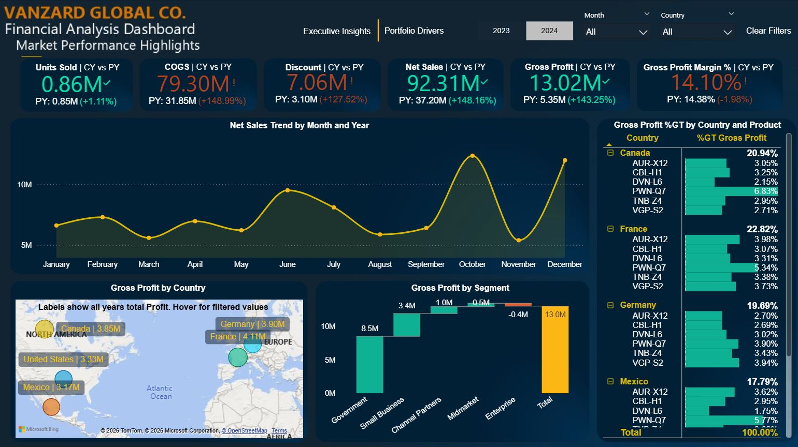
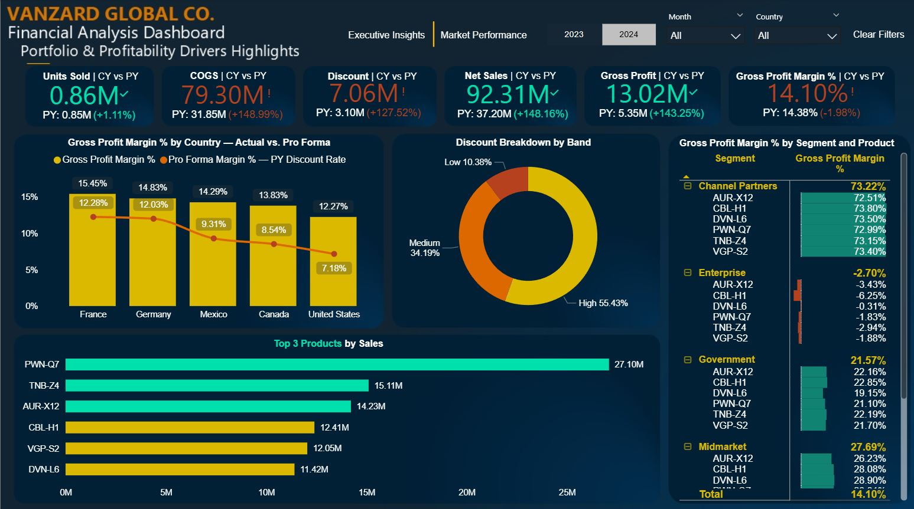

# My Power BI Finance Projects 📊

**Finance Professional | Power BI Practitioner**

This repository showcases my hands-on Power BI application as a finance professional to elevate financial analysis, reporting and business intelligence.
As a Senior Financial Analyst using Power BI modern development practices to strengthen financial reporting, dashboard reporting, and data-driven insights. My focus is on utilizing DAX and data visualizations to transform datasets into clear, actionable financial insights that drive strategic decision-making.

---

## Featured Project

### [Vanzard Financial Analysis Dashboard]

> A financial analysis solution built in Power BI, demonstrating end-to-end BI development — from data handling and modeling to dynamic interactive reporting and surfacing insights.

📂 **[View Full Project Details (README)](./Vanzard_Financial_Analysis_PowerBI/README.md)**

**Page 1 — Executive Insights & Recommendations Dashboard Preview**

**Page 2 — Market Performance Dashboard Preview**

**Page 3 — Portfolio & Profitability Drivers Dashboard Preview**

**Key Skills & Techniques Demonstrated:**
* **Power Query (ETL):** Data shaping and transformation for financial datasets.
* **Data Modeling:** Calculated columns and structured data modeling & relationship building for accurate measurement.
* **DAX Development:** Advanced & explicit DAX measures for conditional formatting & PVM Impact Analysis, Profit Margin and Pro Forma Variance Analysis calculations.
* **Financial Visualization:** Financial KPI design. Designing intuitive interactive visualizations for financial charts.
* **Geospatial Analysis:** Mapping geographic financial data for regional performance insights.
* **Interactive UX:** Implementing slicers, buttons, and drill-through functionality for deep-dive analysis.

---

## About This Portfolio

The project linked above is contained within its respective folder, featuring a detailed `README.md` documentation. This file provides deeper insights into the specific financial objectives, data source utilized, advanced Power BI techniques employed, business-focused visual design and a closer look at the dashboard build process. I am continually developing my skills to bridge the gap between finance and advanced BI tools.

**Tools & Stack:** Power BI Desktop · DAX · Power Query · Excel
